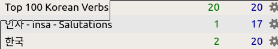
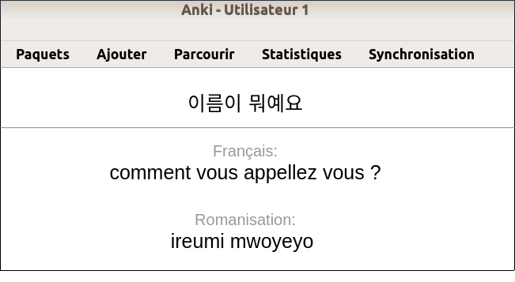

# 배우다 - Beauda - Learn - Apprendre

Create Anki deck and Card from you markdown file


## :package: Installation

pandoc is required on you system to allow to convert html content into markdown

### Requirements

* python 3.10+
* httpx
* pypandoc
* beautifulsoup4

### Install the project

create a virtualenv

```bash
python3 -m venv baeuda
cd baeuda
source bin/activate
```

clone the project

```bash
git clone https://github.com/foxmask/baeuda.git
cd baeuda
```
or
```bash
pip install baeuda
```

### Settings

edit `settings.py`

```
# from which folder does baeuda read the note to create into anki ?
# FOLDER = '/home/foxmask/MesNotes/Corée🇰🇷/공부/Kimchi!/'
# FOLDER = '/home/foxmask/MesNotes/Corée🇰🇷/공부/Cours - Active Korean 1 - 2020-2021'
# FOLDER = '/home/foxmask/MesNotes/Corée🇰🇷/공부/Cours - Active Korean 2 - 2021-2022'
# FOLDER = '/home/foxmask/MesNotes/Corée🇰🇷/공부/Cours - Active Korean 3 - 2022-2023'
FOLDER = '/home/foxmask/MesNotes/Corée🇰🇷/공부/Cours - Active Korean 4 - 2023-2024'
# FOLDER = '/path/to/your/markdown/files'
# PYPANDOC_MARKDOWN = 'markdown_github'
PYPANDOC_MARKDOWN = 'gfm'

ANKI_URL = 'http://localhost:8765/'   # url provided by AnkiConnect https://ankiweb.net/shared/info/2055492159

# anki deck name is made by the first H1 of the Markdown
# anki deck are named : "Book name - Unit X - unit title"
#
# ANKI_DECK = 'Active Korean 3 - Unit 1'

ANKI_MODEL = "Korean (2 colonnes foxmask)"  # Coréen / Français
ANKI_FIELD_COUNT = 2   # number of columns to grab from a markdown table
ANKI_FIELDS = ['Coréen', 'Français', ]  # put the name of the fields you want to use with the "ANKI_MODEL"

# ANKI_MODEL = 'Korean (foxmask)'  # fields are front/back/romanisation
# ANKI_FIELD_COUNT = 3   # number of columns to grab from a markdown table
# ANKI_FIELDS = ['Coréen', 'Romanisation', 'Français']

DATASOURCE = 'MdFile'  # MdFile
```


## :dvd: DataSource

### Markdown files

The name of the file should have to be that way:

`foobar - xxx - yyy.md`

for example

`Kimchi! 01 - insa - 인사.md`

Baeuda will create note with xxx and yyy as tag in anki.
In our example : `insa` and `인사`

## Format of notes for Anki

To process, all the markdown files should have, at least, those content structure:

* h1 with the title of your markdown file
* h2 with tags name (optional)
* table with same headers name of the "fields" defined in the "anki type of note"

Let's see with an example :

In anki, among the provided types of notes, you can find "basic" which content 2 fields "recto" and "verso"

so in your markdown file you will have to create tables with headers named *recto* and *verso*


```
Title of the note - Topic - details

Recto | Verso
-------- | --------
Color on the sun ? | Yellow
Universal reply ? | 42
```

real example with three columns
```
Kimchi! Fiche 1 - 인사 - insa - salutations
Coréen | Romanisation | Français
------ | ------------ | --------
안녕하세요 | annyeonghaseyo | bonjour

```


## Anki desktop

To add cards to Anki, you need to use an existing model (also known as "type of notes")

There are many models you can use, if none fit your needs, you can create on as I did :
`tools > type of notes` then `add` button and choose `Duplicate Basic (and reversed card)` then we'll add a third fields `Romanisation` and will change `Front` to `Coreen` and `Back` to `Français`

Then add this addon [AnkiConnect](https://foosoft.net/projects/anki-connect/index.html#installation) to allow Anki to allow us to add the notes with the current script.


## Let's Go

First of all, start Anki on your desktop

### simulated process

```bash
python baeuda/run.py -a report
```
will display a table of all the grabbed data to create card


### creating cards

```bash
python baeuda/run.py -a go
```

during the execution, you can have a look in anki and see the decks created and receiving cards ;)


## From Markdown file to Anki in images

2) baeuda running in the console


3) Anki with the new created decks



4) the cards of the deck


5) one card




(Image credits to [Emojipedia](https://emojipedia.org/))
